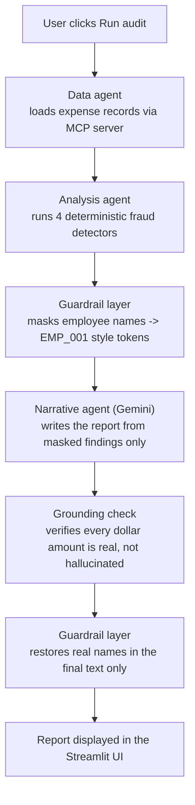

# AuditX

**Fraud and compliance watchdog for expense data.**

AuditX is a multi-agent AI system that analyzes corporate expense data, detects fraud and compliance risk patterns, and produces a clear, plain-English audit report — while making sure the AI writing that report never sees a single real employee's name.

Built for Kaggle's [AI Agents: Intensive Vibe Coding Capstone Project](https://www.kaggle.com/competitions/vibecoding-agents-capstone-project), Agents for Business track.

---

## Why this exists

Most "AI agent" demos pipe raw data straight into a language model without a second thought. That's a real problem the moment the data includes anything sensitive — employee names, salaries, card numbers.

AuditX is built the other way around: **the parts of the system that touch real, sensitive data are deterministic Python, not an LLM.** The AI only ever sees anonymized tokens like `EMP_001`. Real names are restored afterward, in code, only once every number in the AI's output has been checked against what was actually found.

This isn't a claim — it's a passing automated test. See [Results](#results) below.

## What it catches

Four fraud and compliance patterns, the same ones a human auditor looks for:

| Pattern | What it means |
|---|---|
| **Structuring** | Several expenses just under an approval threshold, submitted in a short window — a classic sign of someone avoiding review |
| **Duplicate claims** | The same expense (vendor, amount, date, employee) submitted more than once |
| **Category spend spikes** | A department's spend in one category jumps far above its normal monthly average |
| **Statistical outliers** | A single expense that's far outside the normal range for its category |

## Architecture



The key design decision: **real employee data and the LLM call never occupy the same step.** Detection happens in plain pandas/numpy before any AI is involved. Masking happens before the one and only LLM call. Unmasking happens after a hallucination check, entirely in Python.

## Concepts demonstrated

This project deliberately covers more than the minimum three concepts required by the capstone:

- **Multi-agent system** — built with Google's Agent Development Kit (ADK): a data agent, an analysis agent, and a narrative agent, each with a single responsibility
- **MCP server** — a local FastMCP server exposes the expense dataset as tools (`get_schema`, `get_expenses`, `get_summary_stats`) that the data agent calls over stdio
- **Agent skills** — the fraud-detection logic is a reusable, deterministic skill, not left to the LLM to "notice" patterns on its own
- **Security guardrails** — PII masking before any LLM call, plus an automated grounding/hallucination check on every generated report before real names are restored
- **Agent evaluation** — a 22-test suite (`eval/run_evals.py`) checks detection accuracy against known ground truth, guardrail correctness, and end-to-end pipeline integrity

## Results

```
Total Tests: 22
Passed     : 22
Failed     : 0
*** ALL TESTS PASSED ***
```

On the included synthetic dataset (617 expense records, reproducible with a fixed random seed), AuditX surfaced **24 findings** — including every anomaly deliberately planted for testing, plus several additional structuring and spend-spike patterns the detection logic caught on its own, without being told to look for them specifically.

A task that would take a human auditor hours of manual review runs in under a minute.

## Project structure

```
auditx-capstone/
├── data/
│   ├── generate_dataset.py       # synthetic dataset generator, fixed seed
│   └── expenses.csv              # 617-row generated dataset
├── mcp_server/
│   └── server.py                 # FastMCP server exposing the dataset as tools
├── agents/
│   ├── data_agent.py             # ADK agent, retrieves data via MCP
│   ├── analysis_agent.py         # ADK agent, runs fraud detection
│   ├── narrative_agent.py        # ADK agent, writes the report (masked input only)
│   ├── orchestrator.py           # drives the full pipeline end to end
│   ├── skills/
│   │   └── fraud_detection.py    # deterministic detection logic
│   └── guardrails/
│       └── pii_guard.py          # masking, unmasking, grounding validation
├── eval/
│   └── run_evals.py              # 22-test evaluation suite
├── streamlit_app.py              # dark-themed UI wrapping the pipeline
├── outputs/
│   └── audit_report.txt          # generated report (created on each run)
├── requirements.txt
└── .env.example
```

## Running it locally

```bash
python -m venv venv
venv\Scripts\activate          # Windows
pip install -r requirements.txt

# Add your Gemini API key
cp .env.example .env           # then edit .env and paste your key

# Generate the dataset
python data/generate_dataset.py

# Run the test suite
python eval/run_evals.py

# Launch the app
streamlit run streamlit_app.py
```

Get a free Gemini API key at [Google AI Studio](https://aistudio.google.com).

## Tech stack

- **Google Agent Development Kit (ADK)** — agent orchestration
- **FastMCP** — local MCP server for data access
- **Gemini 2.5 Flash** — narrative generation
- **pandas / numpy** — deterministic fraud detection logic
- **Streamlit** — user interface

## Track

Submitted to the **Agents for Business** track of the [AI Agents: Intensive Vibe Coding Capstone Project](https://www.kaggle.com/competitions/vibecoding-agents-capstone-project).